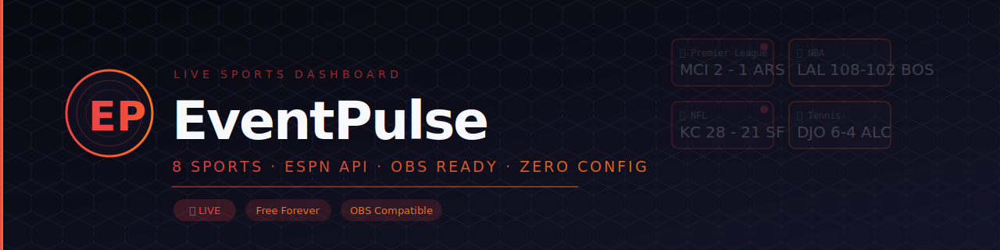

# 🔥 Event Pulse Live Dashboard

<div align="center">




[](https://samotech.github.io/EventPulseChat/)
[](https://www.youtube.com/@EventPulseChat)
[](https://github.com/SamoTech/EventPulseChat/stargazers)
[](https://github.com/SamoTech/EventPulseChat/network/members)
[](https://github.com/SamoTech/EventPulseChat/issues)
[](LICENSE)

**Professional Multi-Sport Live Dashboard with Real-Time ESPN API Integration**

Broadcast-quality sports dashboard optimized for OBS, featuring **8 major sports** with live scores, clickable match details, and zero setup required.

[🚀 Live Demo](https://samotech.github.io/EventPulseChat/) • [📺 YouTube Channel](https://www.youtube.com/@EventPulseChat) • [📖 Documentation](#-features) • [🐛 Report Bug](https://github.com/SamoTech/EventPulseChat/issues)


</div>

---

## 📺 YouTube Channel

**Subscribe to our channel for tutorials, updates, and live sports coverage!**

[](https://www.youtube.com/@EventPulseChat)
[](https://www.youtube.com/channel/UCW4W4H_lEYd1CPZpYpjVfXA)

📹 **What You'll Find:**
- Dashboard setup tutorials
- OBS integration guides
- Live sports streaming tips
- Feature updates & demos
- Sports highlights & analysis

👉 **[Visit Channel](https://www.youtube.com/channel/UCW4W4H_lEYd1CPZpYpjVfXA)**

---

## 🎯 Features

### ✨ NEW: Enhanced Interactive Experience

- 🎮 **Clickable Match Cards** - Click any game for full-screen detailed view
- 🏟️ **Venue Information** - Stadium names, city, attendance
- 📺 **Broadcast Details** - TV channels and streaming info
- 📊 **Team Records** - Win-loss statistics
- 🔄 **Individual Refresh** - Update specific games on-demand
- 🎨 **Animated Modals** - Smooth transitions and professional design

### 🏆 8 Major Sports Covered

| Sport | Coverage | API | Status |
|-------|----------|-----|--------|
| ⚽ **SOCCER** | 10+ Leagues (PL, La Liga, UCL, etc.) | ESPN | ✅ Live |
| 🏀 **NBA** | All teams, real-time scores | ESPN | ✅ Live |
| 🏈 **NFL** | All teams, real-time scores | ESPN | ✅ Live |
| 🎾 **TENNIS** | ATP & WTA tournaments | ESPN | ✅ Live |
| 🏒 **HOCKEY** | NHL all games | ESPN | ✅ Live |
| ⚾ **BASEBALL** | MLB all games | ESPN | ✅ Live |
| 🏏 **CRICKET** | International matches | ESPN | ✅ Live |
| 🥊 **MMA/UFC** | Fight cards & events | Mock | 📅 Upcoming |

### ⚽ Soccer Leagues Included

- 🏴󠁧󠁢󠁥󠁮󠁧󠁿 **Premier League** (England)
- 🇪🇸 **La Liga** (Spain)
- 🇮🇹 **Serie A** (Italy)
- 🇩🇪 **Bundesliga** (Germany)
- 🇫🇷 **Ligue 1** (France)
- 🇳🇱 **Eredivisie** (Netherlands)
- 🏆 **UEFA Champions League**
- 🏆 **UEFA Europa League**
- 🏆 **UEFA Conference League**
- 🌍 **FIFA World Cup**

### 🚀 Core Features

- ✅ **Zero Configuration** - No API keys required, works immediately
- ✅ **100% Free** - All APIs are public ESPN endpoints
- ✅ **Real-time Updates** - Automatic refresh every 30 seconds
- ✅ **Live Indicators** - 🔴 LIVE badges for active games
- ✅ **OBS Ready** - Perfect for 1920x1080 broadcasts
- ✅ **Mobile Responsive** - Works on all devices
- ✅ **Lightweight** - Fast loading, minimal bandwidth
- ✅ **Dark Theme** - Professional broadcast-quality design
- ✅ **Smart Caching** - Efficient API usage
- ✅ **Fallback System** - Continues working if API fails

---

## 🚀 Quick Start (2 Minutes!)

### Step 1: Enable GitHub Pages

1. Go to **[Settings → Pages](https://github.com/SamoTech/EventPulseChat/settings/pages)**
2. Under "Build and deployment":
   - **Source:** Deploy from a branch
   - **Branch:** `main`
   - **Folder:** `/ (root)`
3. Click **Save**
4. Wait 2-3 minutes for deployment ⏰

### Step 2: Access Your Dashboard

🎉 **That's it!** Your dashboard is live at:

👉 **https://samotech.github.io/EventPulseChat/**

---

## 🎥 OBS Studio Integration

```
URL: https://samotech.github.io/EventPulseChat/
Width: 1920  |  Height: 1080  |  FPS: 30
```

---

## 📄 License

**MIT License** - Free for personal and commercial use

---

## 💬 Support & Community

- 🐛 **[Report Bug](https://github.com/SamoTech/EventPulseChat/issues/new?labels=bug)**
- 💡 **[Request Feature](https://github.com/SamoTech/EventPulseChat/issues/new?labels=enhancement)**
- 📺 **[YouTube Tutorials](https://www.youtube.com/channel/UCW4W4H_lEYd1CPZpYpjVfXA)**

---

<div align="center">

Built with ❤️ for sports fans and content creators · [SamoTech](https://github.com/SamoTech)

⭐ **Star this repo** if you find it useful!

*Version 2.0 — 10+ Soccer Leagues · Clickable Match Details*

</div>
